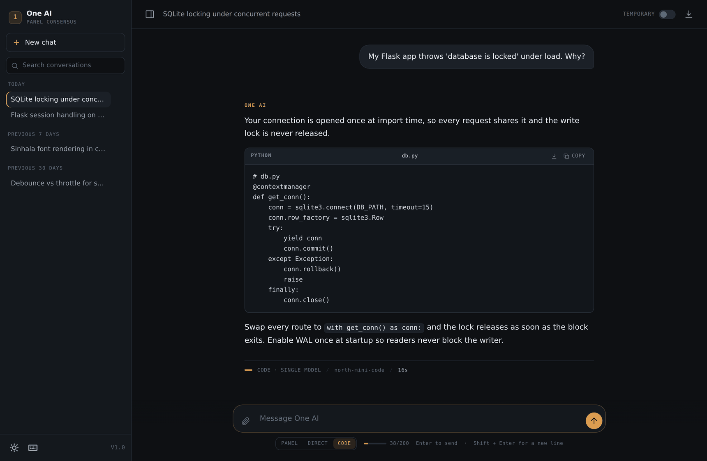
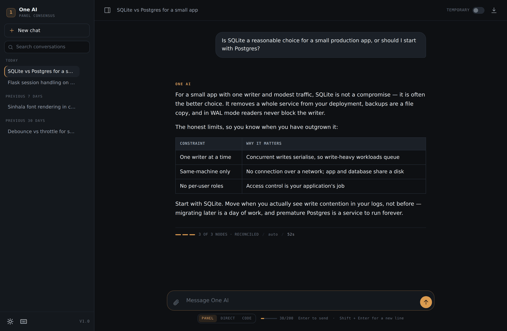
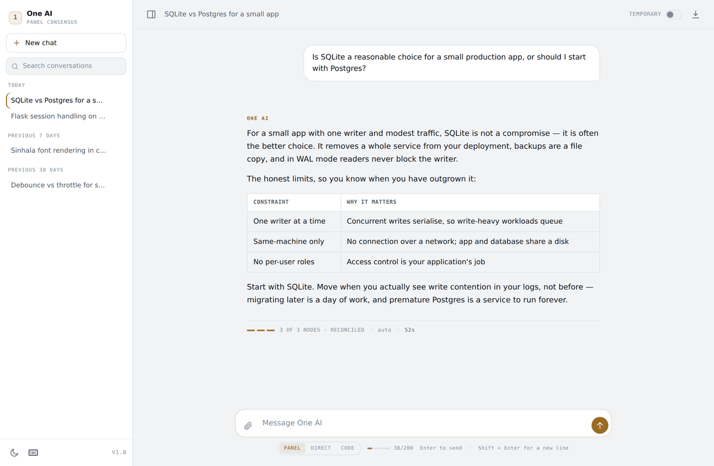
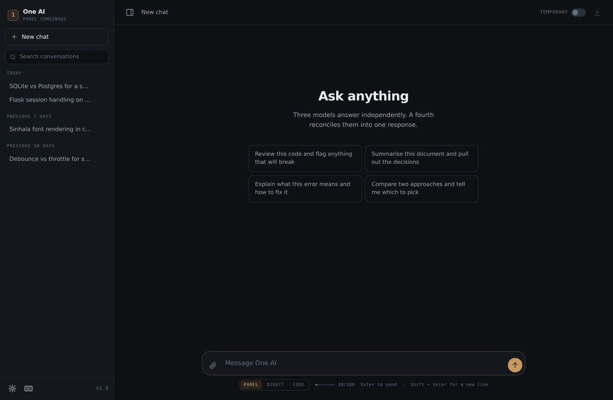
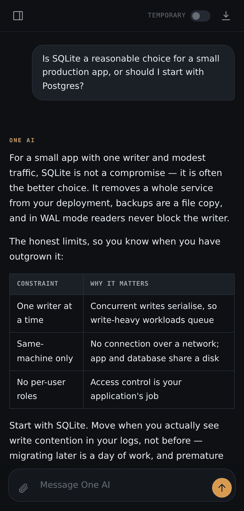

<div align="center">


# One AI

**A self-hosted AI chat app that runs entirely on free models — and refuses to call a paid one.**

Three models answer independently, a fourth reconciles them, and every response
carries a receipt showing exactly what happened.

[](https://github.com/dananjayanadun/one-ai/actions/workflows/tests.yml)
[](https://www.python.org/downloads/)
[](LICENSE)
[](#free-only--enforced-not-suggested)



</div>

---

## What it is

A Flask app you run yourself. It talks to [OpenRouter](https://openrouter.ai),
uses only zero-cost models, and stores everything in one SQLite file next to the
code.

It exists because free models are individually mediocre but collectively useful
— and because most chat interfaces hide *which* model answered and *how well it
went*. This one tells you, every time.

```
┌─────────────┐   ┌──────────────┐   ┌────────────┐
│  Reasoning  │   │  Technical   │   │  Clarity   │    three models,
│    node     │   │     node     │   │    node    │    asked in parallel
└──────┬──────┘   └───────┬──────┘   └──────┬─────┘
       └──────────────────┼─────────────────┘
                          ▼
                  ┌───────────────┐
                  │  Aggregator   │   reconciles conflicts, writes one answer
                  └───────┬───────┘
                          ▼
              3 OF 3 NODES · RECONCILED / 52s
```

---

## Highlights

| Feature | What it gives you |
|:--|:--|
| **Free, and enforced** | Every model ID is checked against live pricing *before* the request is sent. A paid model raises instead of dialling out. |
| **Three answer modes** | Panel for open questions, Direct for speed, Code for programming with a 32K output budget. |
| **Consensus receipt** | Each answer shows which nodes replied, which model wrote it, and how long it took — stored with the message, not a toast you miss. |
| **Real attachments** | Images to a vision model; PDF and DOCX extracted server-side; 40+ code and text formats inlined. |
| **Budget meter** | The free tier allows ~200 requests a day and panel mode spends four per message. The counter stops you finding out the hard way. |
| **Edit and branch** | Rewrite any message; everything after it is replaced rather than leaving a contradictory second copy. |
| **Light and dark** | Follows your OS, remembers your choice, fully keyboard driven. |
| **296 tests** | Backend, attachments, editing, mode routing, free-only enforcement, and the DOM. |

---

## Quick start

**Never used a terminal? Open [`START-HERE.md`](START-HERE.md)** — it assumes
nothing is installed.

```bash
git clone https://github.com/dananjayanadun/one-ai.git
cd one-ai

bash setup.sh          # Windows: double-click setup.bat
# paste your free key from https://openrouter.ai/keys into .env
bash run.sh            # Windows: double-click run.bat
```

Open <http://127.0.0.1:5000>.

The setup script builds an isolated environment inside the project folder,
installs everything, generates a `SECRET_KEY`, and runs a diagnostic. Nothing is
installed system-wide — deleting the folder removes all of it.

If anything looks wrong:

```bash
.venv/bin/python tools/doctor.py
# Windows: .venv\Scripts\python.exe tools\doctor.py
```

It checks Python, packages, your key, the database, network reachability, and
which free models are currently live — and tells you what to do about each
failure rather than just that one happened.

---

## Modes

The switch sits under the composer and is remembered between sessions.

| Mode | Requests | Output cap | Best for |
|:--|:--:|:--:|:--|
| **Code** | 1 | 32,000 | Writing, reviewing, and debugging code |
| **Direct** | 1 | 4,096 | Quick general answers |
| **Panel** | 4 | 4,096 | Open questions, comparisons, judgement calls |

**Use Code mode for code.** The panel is the wrong shape for it. Ensembling
helps when errors are uncorrelated and answers are fuzzy; code is verifiable and
brittle. Three weak models produce three *different* designs, and a fourth weak
model that never runs any of them splices them together.

If a response hits the token ceiling, the app asks the model to continue from
where it stopped and stitches the parts together. If it is still incomplete, the
receipt says `OUTPUT LIMIT REACHED` rather than quietly handing you half a file.

<div align="center">

<sub><em>Panel mode. The strip under the answer is the receipt: three nodes replied, reconciled, 52 seconds.</em></sub>
</div>

---

## Free only — enforced, not suggested

`FREE_ONLY=true` is not a preference the code politely honours. Every model ID is
verified against live catalog pricing immediately before the request goes out,
and a paid one raises rather than dialling out. There is a test asserting that a
paid model results in **zero network calls**.

When the catalog is unreachable the guard falls back to OpenRouter's `:free`
naming convention and treats any unsuffixed ID as paid. Conservative by design:
the failure mode is *"refused to answer"*, never *"spent your money"*.

```bash
curl localhost:5000/api/models   # what each mode would use, with a free flag on every entry
```

### Best free models, August 2026

Ranked by OpenRouter's own Programming category:

| Model | Rank | Context | Notes |
|:--|:--:|:--:|:--|
| `cohere/north-mini-code:free` | **#18** | 256K | 64K output, Apache 2.0 — default first pick |
| `nvidia/nemotron-3.5-lightning:free` | #22 | 1M | Fast, high throughput |
| `nvidia/nemotron-3-super-120b-a12b:free` | #28 | 1M | Strong on SWE-Bench Verified |
| `google/gemma-4-26b-a4b-it:free` | — | 256K | Vision: images and video |

> [!WARNING]
> **Poolside's free tier trains on your traffic.** Their models are genuinely
> strong at coding, but the free tier states that inputs and outputs may be used
> for training. When the input is your source code, that is a real cost even
> though it is not a monetary one. They are ordered last; `TRAINS_ON_FREE`
> controls this. Cohere and NVIDIA carry no such notice.

> [!NOTE]
> **IDs go stale fast.** `qwen/qwen3-coder:free` and `gemma-4-31b-it:free` were
> both defaults here weeks ago and are already delisted. That is why the app
> queries the live catalog: pinned IDs are a starting point, not a dependency.
> If a mode starts failing, clear `CODE_MODELS` and let discovery pick.

---

## Attachments

Click the paperclip, drag files onto the window, or paste a screenshot straight
into the composer. Up to five files per message.

| Type | What happens |
|:--|:--|
| PNG, JPG, WEBP, GIF | EXIF-rotated, downscaled, re-encoded, sent to a **vision** model |
| PDF | Text extracted server-side, page by page |
| DOCX | Paragraphs and table rows extracted |
| 40+ text and code formats | Decoded and inlined into the prompt |

Extraction runs on the server, because the browser cannot read PDF or DOCX and a
client-supplied file type cannot be trusted. Images route to vision-capable
models specifically: a text-only model handed an image silently drops it and
answers confidently about nothing, which is worse than an error.

---

## Interface

<table>
<tr>
<td width="50%"></td>
<td width="50%"></td>
</tr>
<tr>
<td align="center"><sub>Light theme, following your OS by default</sub></td>
<td align="center"><sub>Empty state</sub></td>
</tr>
</table>

<div align="center">

<br><sub>Mobile: the sidebar becomes an overlay drawer</sub>
</div>

### Keyboard

| Shortcut | Action |
|:--|:--|
| <kbd>Enter</kbd> | Send |
| <kbd>Shift</kbd> + <kbd>Enter</kbd> | New line |
| <kbd>Ctrl</kbd>/<kbd>⌘</kbd> + <kbd>K</kbd> | Focus search |
| <kbd>Ctrl</kbd>/<kbd>⌘</kbd> + <kbd>B</kbd> | Toggle sidebar |
| <kbd>Ctrl</kbd>/<kbd>⌘</kbd> + <kbd>J</kbd> | Toggle theme |
| <kbd>Esc</kbd> | Cancel edit, close dialogs, **stop generating** |
| <kbd>?</kbd> | Shortcut list |

---

## Configuration

Everything lives in `.env`, generated from `.env.example` by the setup script.

```bash
OPENROUTER_KEY=sk-or-v1-...     # required, free from openrouter.ai/keys
SECRET_KEY=...                  # generated for you
FREE_ONLY=true                  # leave this on
DEFAULT_MODE=code               # panel | direct | code
STREAMING=false                 # true locally; PythonAnywhere buffers responses
DB_PATH=                        # absolute path recommended when deployed
```

Full reference: [`docs/DEPLOYMENT.md`](docs/DEPLOYMENT.md).

---

## Project layout

```
one-ai/
├── app.py              routes, validation, error handling
├── config.py           env config with startup validation
├── db.py               SQLite access, schema, migrations
├── llm.py              panel orchestration, streaming, fallbacks
├── models.py           live catalog + free-only enforcement
├── attachments.py      upload validation and text extraction
├── templates/
│   └── index.html      the entire frontend, no build step
├── tools/
│   ├── make_env.py     creates .env with a generated SECRET_KEY
│   └── doctor.py       diagnoses a broken install
└── tests/              296 tests, no API key required
```

No build step, no bundler, no `node_modules`. The frontend is one HTML file with
inline SVG icons. The only runtime CDN dependencies are `marked`, `DOMPurify`,
and Prism — and if any of them fail to load, the app degrades to readable plain
text rather than a blank screen.

---

## Tests

```bash
python -m tests.test_smoke          # 34  routes, DB, migrations
python -m tests.test_attachments    # 54  upload, extraction, vision routing
python -m tests.test_editing        # 44  edit, regenerate, export
python -m tests.test_modes          # 37  mode routing, continuation, streaming
python -m tests.test_free_only      # 35  paid-model blocking, rate limits

npm install jsdom && node tests/dom_test.js   # 92  frontend in a real DOM
```

No API key needed — the model layer is stubbed throughout. Tests also ignore
your `.env`, so your own settings cannot change what they exercise.

---

## Deploying

Runs anywhere Python does. [`docs/DEPLOYMENT.md`](docs/DEPLOYMENT.md) covers
PythonAnywhere and gunicorn.

> [!IMPORTANT]
> **PythonAnywhere's free tier cannot reach OpenRouter.** Free accounts route
> outbound traffic through a proxy limited to allowlisted domains, so requests
> fail with a 403. Either upgrade, or ask their support to allowlist
> `openrouter.ai`.

---

## Known limitations

Stated plainly, because a README that only lists strengths is not much use:

- **No authentication.** Anyone who reaches the URL can read every chat and
  spend your request allowance. Fine on `localhost`; add a login before putting
  it on a public address.
- **No tool use.** It cannot read your project, run your tests, or apply a
  patch. You paste code in and copy code out. This — not model quality — is the
  real gap between this and an agentic CLI.
- **Streaming is local-only in practice.** It works, but PythonAnywhere buffers
  responses, so the whole answer arrives at once anyway.
- **SQLite.** Correct and fast for one user. It will not hold up under real
  concurrency.
- **No OCR.** A scanned PDF is detected and reported, not silently answered from
  nothing. Attach it as an image instead.

---

## Contributing

Issues and pull requests are welcome. Please run the full suite first — CI runs
it on Python 3.9, 3.11, and 3.13.

Background on the architecture and the design decisions is in
[`docs/ENGINEERING.md`](docs/ENGINEERING.md).

## License

[MIT](LICENSE)
